# Diagrama de Casos de Uso - Sistema ERP

```mermaid
graph TD
    %% Actores
    A1[Administrador] --> S
    A2[Vendedor] --> S
    A3[Gerente] --> S
    A4[Cliente] --> S
    A5[Empleado] --> S

    %% Sistema
    S[ERP Sistema]

    %% Casos de Uso
    S --> UC1[Gestión de Usuarios]
    S --> UC2[Gestión de Ventas]
    S --> UC3[Control de Inventario]
    S --> UC4[Gestión de Compras]
    S --> UC5[Control de Producción]
    S --> UC6[Gestión Contable]
    S --> UC7[Recursos Humanos]
    S --> UC8[Marketing]
    S --> UC9[CRM]
    S --> UC10[E-commerce]

    %% Relaciones con Actores
    A1 --> UC1
    A1 --> UC2
    A1 --> UC3
    A1 --> UC4
    A1 --> UC5
    A1 --> UC6
    A1 --> UC7
    A1 --> UC8
    A1 --> UC9
    A1 --> UC10

    A2 --> UC2
    A2 --> UC3
    A2 --> UC9

    A3 --> UC2
    A3 --> UC3
    A3 --> UC4
    A3 --> UC5
    A3 --> UC6
    A3 --> UC7

    A4 --> UC2
    A4 --> UC9
    A4 --> UC10

    A5 --> UC5
    A5 --> UC7

    %% Estilos
    classDef actor fill:#f9f,stroke:#333,stroke-width:2px;
    classDef system fill:#bbf,stroke:#333,stroke-width:2px;
    classDef useCase fill:#dfd,stroke:#333,stroke-width:1px;
    
    class A1,A2,A3,A4,A5 actor;
    class S system;
    class UC1,UC2,UC3,UC4,UC5,UC6,UC7,UC8,UC9,UC10 useCase;
```

## Descripción de Casos de Uso

### 1. Gestión de Usuarios
- Crear, modificar y eliminar usuarios
- Asignar roles y permisos
- Gestionar accesos al sistema

### 2. Gestión de Ventas
- Crear y gestionar pedidos
- Procesar pagos
- Generar facturas
- Seguimiento de ventas

### 3. Control de Inventario
- Gestionar stock
- Registrar entradas/salidas
- Control de almacén
- Alertas de inventario

### 4. Gestión de Compras
- Crear órdenes de compra
- Gestionar proveedores
- Control de gastos
- Seguimiento de compras

### 5. Control de Producción
- Gestionar órdenes de fabricación
- Asignar recursos
- Seguimiento de producción
- Control de calidad

### 6. Gestión Contable
- Registrar transacciones
- Generar balances
- Control de impuestos
- Reportes financieros

### 7. Recursos Humanos
- Gestionar empleados
- Control de nómina
- Gestión de vacaciones
- Evaluaciones

### 8. Marketing
- Campañas publicitarias
- Análisis de mercado
- Gestión de leads
- Reportes de marketing

### 9. CRM
- Gestión de clientes
- Seguimiento de oportunidades
- Historial de interacciones
- Análisis de clientes

### 10. E-commerce
- Catálogo de productos
- Carrito de compras
- Procesamiento de pagos
- Gestión de envíos 