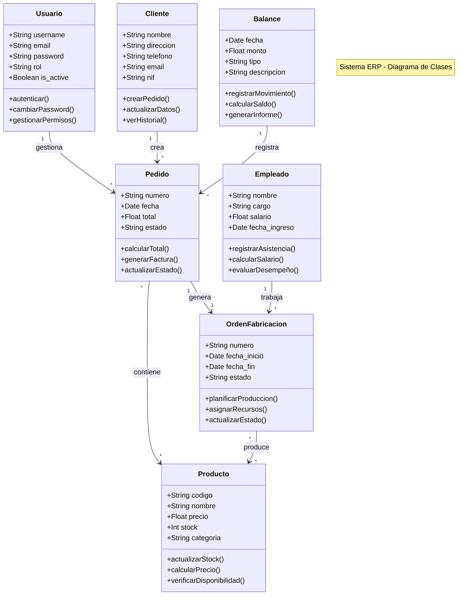

# Diagrama de Clases - Sistema ERP

## Descripción de Clases

### Usuario
- Representa los usuarios del sistema
- Gestiona la autenticación y autorización
- Maneja diferentes roles y permisos

### Cliente
- Almacena información de clientes
- Gestiona pedidos y transacciones
- Mantiene historial de compras

### Pedido
- Representa órdenes de compra
- Calcula totales y gestiona estados
- Genera facturas

### Producto
- Gestiona el catálogo de productos
- Controla inventario y precios
- Verifica disponibilidad

### OrdenFabricacion
- Controla el proceso de producción
- Gestiona recursos y personal
- Seguimiento de progreso

### Balance
- Registra transacciones contables
- Genera reportes financieros
- Calcula balances

### Empleado
- Gestiona información del personal
- Controla asistencia y salarios
- Maneja vacaciones y permisos 