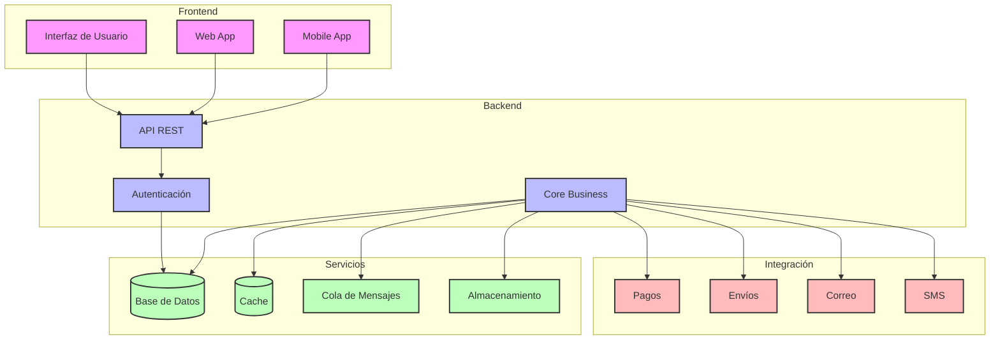

# Diagrama de Componentes - Sistema ERP

## Descripción de Componentes

### 1. Frontend
- **Interfaz de Usuario**
  - Diseño responsivo
  - Componentes reutilizables
  - Validación de formularios

- **Web App**
  - Aplicación web principal
  - Dashboard administrativo
  - Reportes y análisis

- **Mobile App**
  - Aplicación móvil nativa
  - Funcionalidades offline
  - Notificaciones push

### 2. Backend
- **API REST**
  - Endpoints documentados
  - Versionamiento
  - Rate limiting

- **Autenticación**
  - JWT tokens
  - OAuth2
  - Roles y permisos

- **Core Business**
  - Lógica de negocio
  - Reglas de validación
  - Procesos automáticos

### 3. Servicios
- **Base de Datos**
  - PostgreSQL
  - Replicación
  - Backups automáticos

- **Cache**
  - Redis
  - Caché distribuido
  - Invalidez de caché

- **Cola de Mensajes**
  - RabbitMQ
  - Procesamiento asíncrono
  - Retry policies

- **Almacenamiento**
  - S3 compatible
  - CDN
  - Versionamiento de archivos

### 4. Integración
- **Pagos**
  - Stripe/PayPal
  - Múltiples métodos
  - Reconciliación

- **Envíos**
  - APIs de courier
  - Tracking
  - Etiquetas

- **Correo**
  - SMTP
  - Plantillas
  - Seguimiento

- **SMS**
  - Proveedor SMS
  - Notificaciones
  - Confirmaciones

### Interacciones Principales
1. Frontend → API: Peticiones HTTP
2. API → Auth: Validación de tokens
3. Core → DB: Operaciones CRUD
4. Core → Queue: Tareas asíncronas
5. Core → Storage: Archivos
6. Core → Integración: Servicios externos 