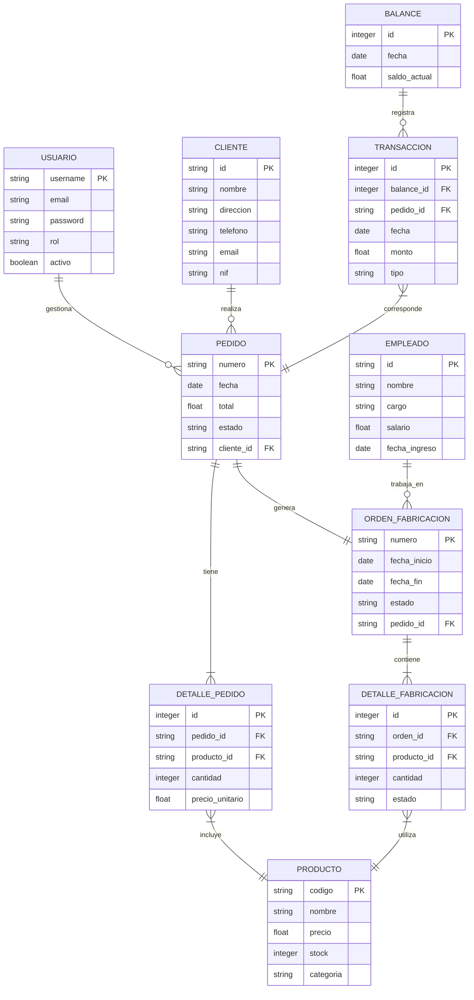

# Diagrama Entidad-Relación (DER) - Sistema ERP

## Descripción de Entidades y Relaciones

### Entidades Principales

#### USUARIO
- Almacena información de usuarios del sistema
- Clave primaria: id
- Relacionada con PEDIDO (1:N)

#### CLIENTE
- Gestiona información de clientes
- Clave primaria: id
- Relacionada con PEDIDO (1:N)

#### PEDIDO
- Registra órdenes de compra
- Clave primaria: id
- Claves foráneas: cliente_id, usuario_id
- Relacionada con DETALLE_PEDIDO (1:N)

#### PRODUCTO
- Gestiona el catálogo de productos
- Clave primaria: id
- Relacionada con DETALLE_PEDIDO (1:N)

#### ORDEN_FABRICACION
- Controla órdenes de producción
- Clave primaria: id
- Clave foránea: pedido_id
- Relacionada con DETALLE_FABRICACION (1:N)

#### EMPLEADO
- Gestiona información del personal
- Clave primaria: id
- Relacionada con ORDEN_FABRICACION (1:N)

#### BALANCE
- Registra transacciones contables
- Clave primaria: id
- Clave foránea: pedido_id
- Relacionada con TRANSACCION (1:N)

### Entidades de Detalle

#### DETALLE_PEDIDO
- Registra productos en cada pedido
- Clave primaria: id
- Claves foráneas: pedido_id, producto_id

#### DETALLE_FABRICACION
- Controla detalles de producción
- Clave primaria: id
- Claves foráneas: orden_id, producto_id

#### TRANSACCION
- Registra movimientos contables
- Clave primaria: id
- Clave foránea: balance_id

### Relaciones
1. Un usuario puede gestionar varios pedidos
2. Un cliente puede realizar varios pedidos
3. Un pedido puede contener varios productos
4. Una orden de fabricación puede producir varios productos
5. Un empleado puede trabajar en varias órdenes de fabricación
6. Un balance puede contener varias transacciones 