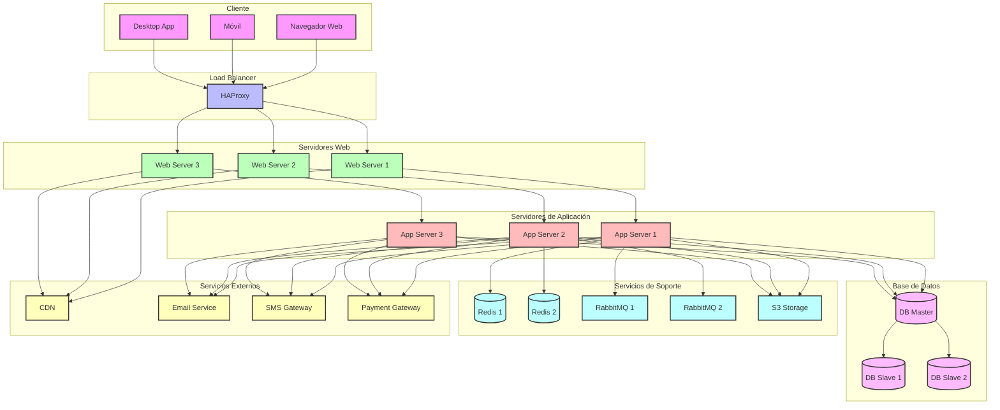

# Diagrama de Despliegue - Sistema ERP

## Descripción de la Arquitectura de Despliegue

### 1. Capa de Cliente
- **Navegador Web**
  - Acceso HTTPS
  - Caché del navegador
  - WebSocket para tiempo real

- **Móvil**
  - App nativa
  - Sincronización offline
  - Push notifications

- **Desktop App**
  - Aplicación cliente
  - Sincronización local
  - Modo offline

### 2. Capa de Balanceo
- **HAProxy**
  - Balanceo de carga
  - SSL termination
  - Health checks
  - Rate limiting

### 3. Capa Web
- **Servidores Web (3 nodos)**
  - Nginx
  - SSL/TLS
  - Caché estática
  - Compresión

### 4. Capa de Aplicación
- **Servidores App (3 nodos)**
  - Django/Gunicorn
  - Procesamiento asíncrono
  - WebSockets
  - Caché de sesión

### 5. Capa de Base de Datos
- **PostgreSQL**
  - Master-Slave
  - Replicación asíncrona
  - Pools de conexiones
  - Backups automáticos

### 6. Servicios de Soporte
- **Redis**
  - Caché distribuido
  - Sesiones
  - Colas de trabajo
  - Pub/Sub

- **RabbitMQ**
  - Colas de mensajes
  - Procesamiento asíncrono
  - Retry policies
  - Dead letter queues

- **S3 Storage**
  - Almacenamiento de archivos
  - CDN
  - Versionamiento
  - Backups

### 7. Servicios Externos
- **CDN**
  - Contenido estático
  - Imágenes
  - Videos
  - Assets

- **Email Service**
  - SMTP
  - Plantillas
  - Seguimiento
  - Bounce handling

- **SMS Gateway**
  - Notificaciones
  - Confirmaciones
  - Alertas
  - 2FA

- **Payment Gateway**
  - Procesamiento de pagos
  - Reconciliación
  - Refunds
  - Fraude

### Características de Alta Disponibilidad
1. Balanceo de carga entre servidores
2. Replicación de base de datos
3. Caché distribuido
4. Colas de mensajes redundantes
5. CDN para contenido estático
6. Health checks y auto-recuperación
7. Backups automáticos
8. Monitoreo y alertas 