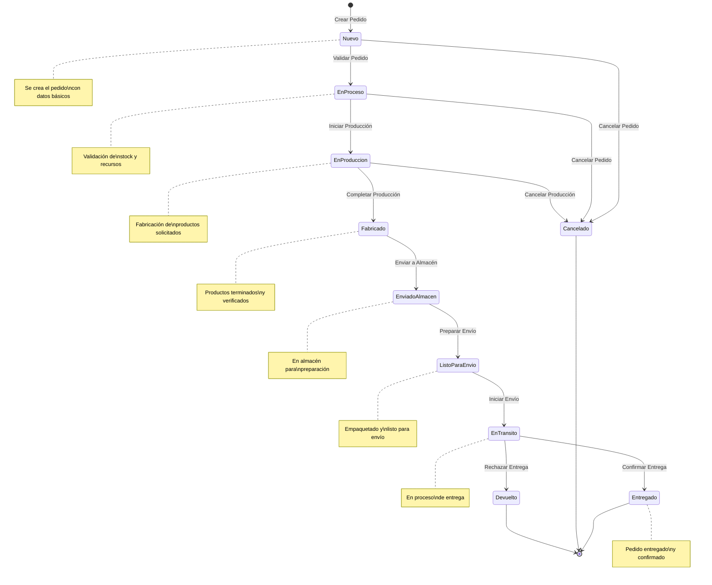

```mermaid
stateDiagram-v2
    [*] --> Nuevo: Crear Pedido
    
    Nuevo --> EnProceso: Validar Pedido
    Nuevo --> Cancelado: Cancelar Pedido
    
    EnProceso --> EnProduccion: Iniciar Producción
    EnProceso --> Cancelado: Cancelar Pedido
    
    EnProduccion --> Fabricado: Completar Producción
    EnProduccion --> Cancelado: Cancelar Producción
    
    Fabricado --> EnviadoAlmacen: Enviar a Almacén
    
    EnviadoAlmacen --> ListoParaEnvio: Preparar Envío
    
    ListoParaEnvio --> EnTransito: Iniciar Envío
    
    EnTransito --> Entregado: Confirmar Entrega
    EnTransito --> Devuelto: Rechazar Entrega
    
    Entregado --> [*]
    Cancelado --> [*]
    Devuelto --> [*]

    note right of Nuevo: Se crea el pedido\ncon datos básicos
    note right of EnProceso: Validación de\nstock y recursos
    note right of EnProduccion: Fabricación de\nproductos solicitados
    note right of Fabricado: Productos terminados\ny verificados
    note right of EnviadoAlmacen: En almacén para\npreparación
    note right of ListoParaEnvio: Empaquetado y\nlisto para envío
    note right of EnTransito: En proceso\nde entrega
    note right of Entregado: Pedido entregado\ny confirmado
``` 