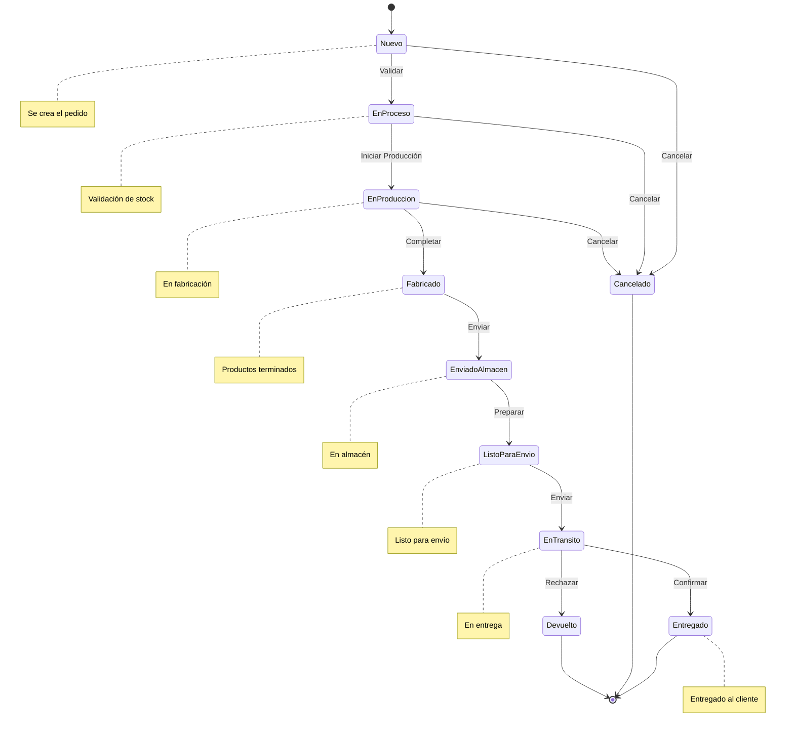

# Diagrama de Estados - Proceso de Pedido



## Descripción del Flujo de Estados

### Estados Iniciales
- **Nuevo**: Estado inicial cuando se crea un nuevo pedido
- **EnProceso**: Validación inicial del pedido

### Estados de Producción
- **EnProduccion**: Fabricación activa del pedido
- **Fabricado**: Productos completados

### Estados de Logística
- **EnviadoAlmacen**: Productos en almacén
- **ListoParaEnvio**: Preparado para envío
- **EnTransito**: En proceso de entrega

### Estados Finales
- **Entregado**: Entrega exitosa
- **Cancelado**: Pedido cancelado
- **Devuelto**: Pedido devuelto

### Transiciones Principales
1. Creación → Validación
2. Validación → Producción
3. Producción → Almacén
4. Almacén → Envío
5. Envío → Entrega

### Estados de Excepción
- Cancelación en cualquier etapa
- Devolución durante el envío
```