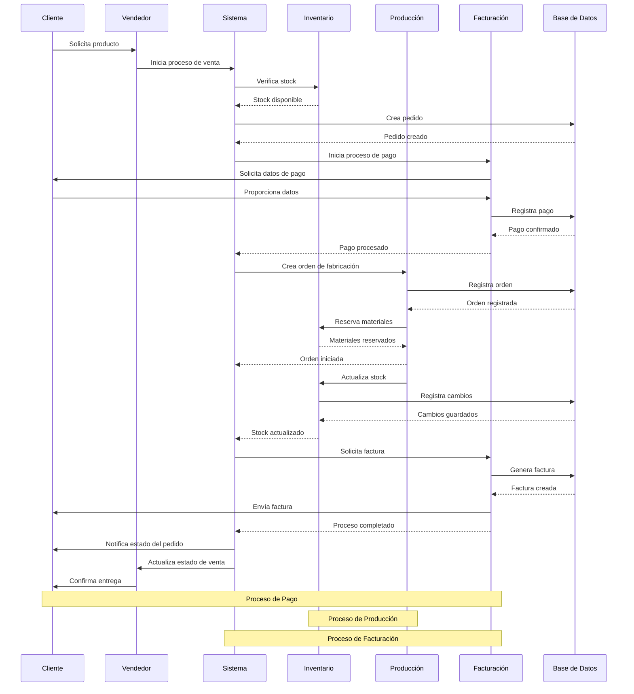

# Diagrama de Secuencia - Proceso de Venta

## Descripción del Proceso de Venta

### 1. Inicio del Proceso
1. Cliente solicita producto al vendedor
2. Vendedor inicia el proceso en el sistema
3. Sistema verifica disponibilidad de stock
4. Se crea el pedido en la base de datos

### 2. Proceso de Pago
1. Sistema inicia el proceso de pago
2. Se solicitan datos de pago al cliente
3. Se procesa el pago
4. Se registra la transacción

### 3. Proceso de Producción
1. Sistema crea orden de fabricación
2. Se registra en la base de datos
3. Se reservan materiales
4. Se inicia la producción

### 4. Actualización de Inventario
1. Se actualiza el stock
2. Se registran los cambios
3. Se confirma la actualización

### 5. Facturación
1. Sistema solicita generación de factura
2. Se crea en la base de datos
3. Se envía al cliente
4. Se completa el proceso

### 6. Notificaciones
1. Cliente recibe actualización de estado
2. Vendedor actualiza información
3. Se confirma la entrega 