# Diagramas del Sistema - ERP Empresa

## 1. Modelo de Análisis (MA)

### 1.1 Diagrama de Casos de Uso
```mermaid
graph TD
    A[Usuario] --> B[Gestión de Inventario]
    A --> C[Ventas y CRM]
    A --> D[Contabilidad]
    A --> E[Recursos Humanos]
    A --> F[Manufactura]
    A --> G[E-commerce]
    
    B --> B1[Ver Stock]
    B --> B2[Registrar Movimientos]
    B --> B3[Alertas de Stock]
    
    C --> C1[Crear Pedidos]
    C --> C2[Gestionar Clientes]
    C --> C3[Historial de Ventas]
    
    D --> D1[Facturación]
    D --> D2[Balance General]
    D --> D3[Estado de Resultados]
    
    E --> E1[Gestión de Empleados]
    E --> E2[Control de Sueldos]
    E --> E3[Evaluaciones]
    
    F --> F1[Órdenes de Producción]
    F --> F2[Control de Calidad]
    F --> F3[Planificación]
    
    G --> G1[Catálogo de Productos]
    G --> G2[Pedidos Online]
    G --> G3[Proceso de Pago]
```

### 1.2 Diagrama de Clases
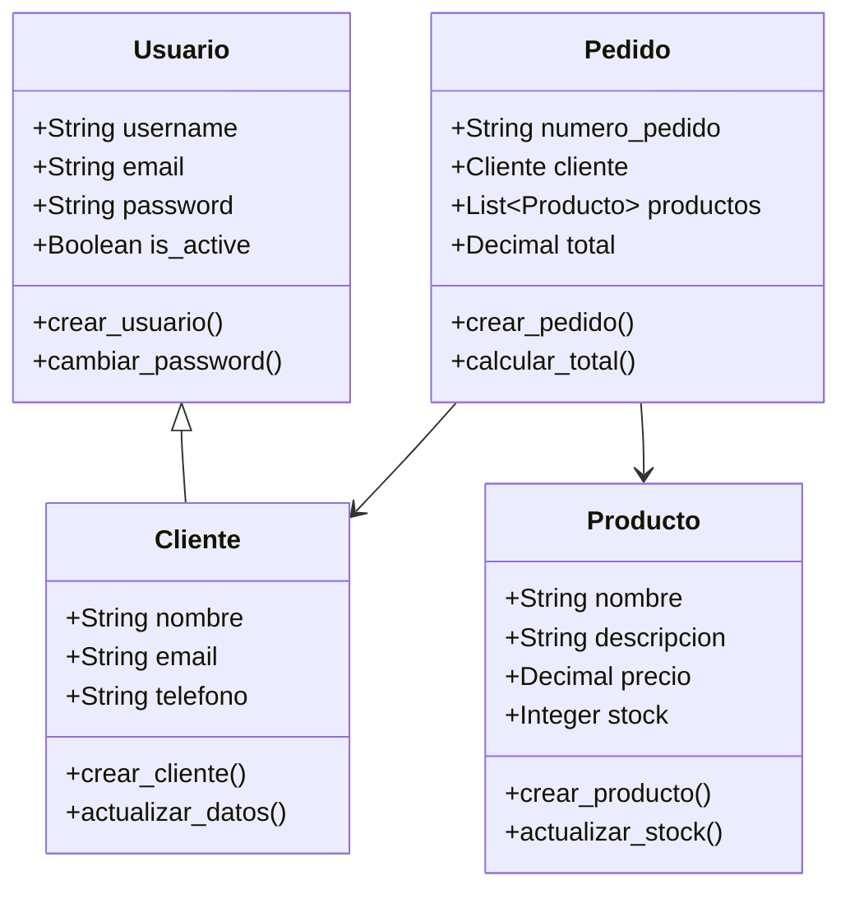

### 1.3 Diagrama Entidad-Relación (DER)
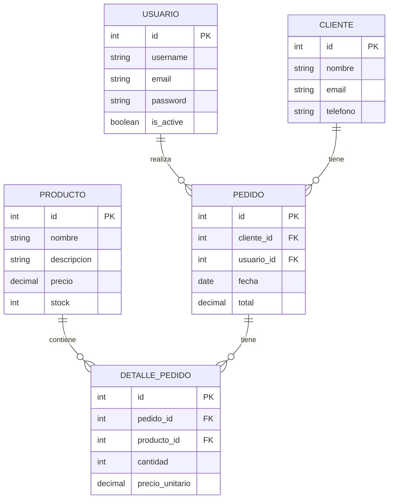

## 2. Modelo de Diseño (MD)

### 2.1 Diagrama de Secuencia - Proceso de Venta
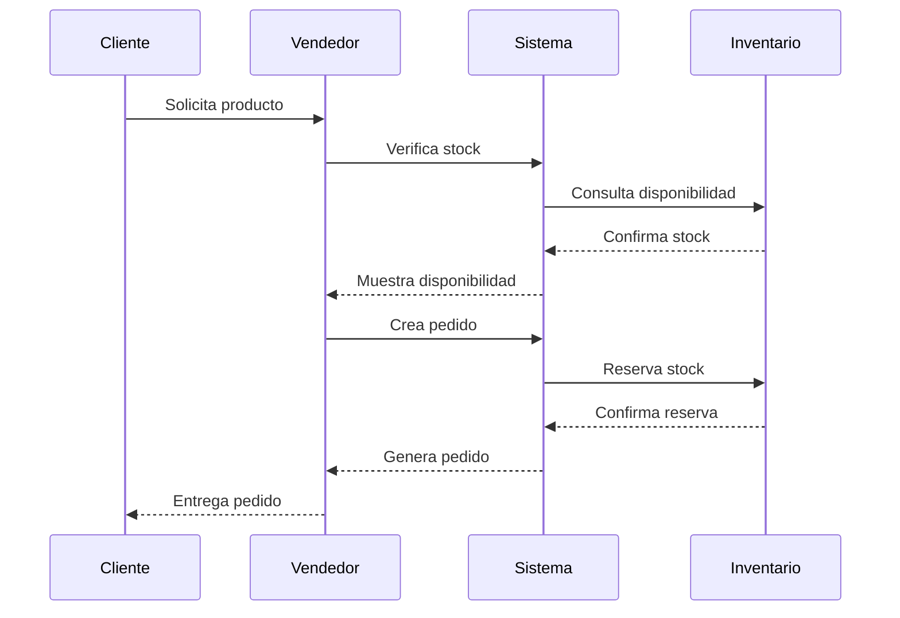

### 2.2 Diagrama de Estados - Pedido
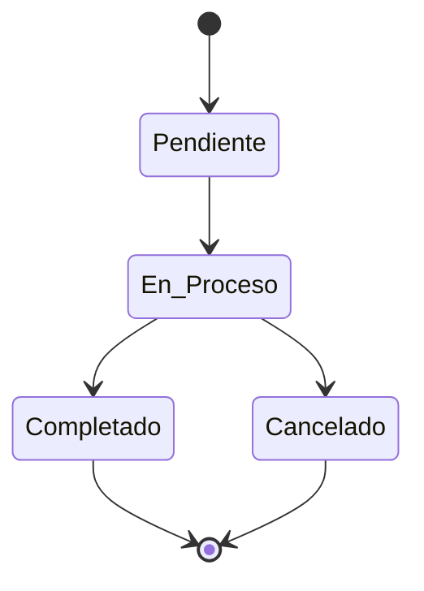

## 3. Especificación de Construcción (EC)

### 3.1 Diagrama de Componentes
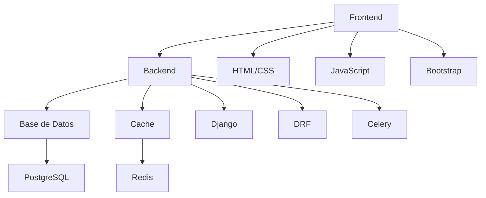

### 3.2 Diagrama de Despliegue
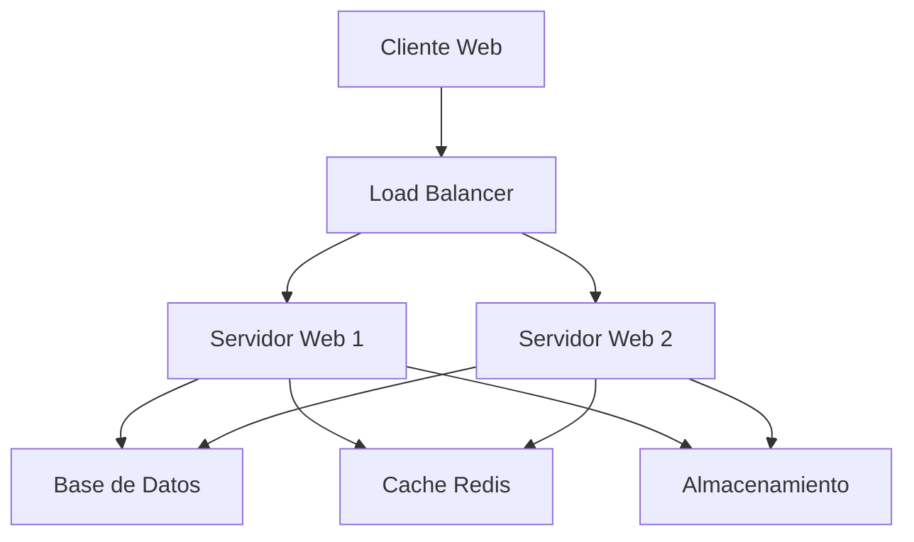

## 4. Flujos de Proceso

### 4.1 Proceso de Fabricación
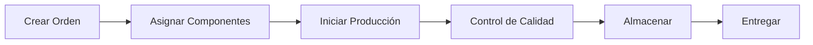

### 4.2 Proceso de Compra
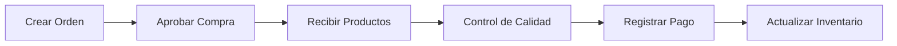

## 5. Arquitectura de Datos

### 5.1 Modelo de Datos Principal
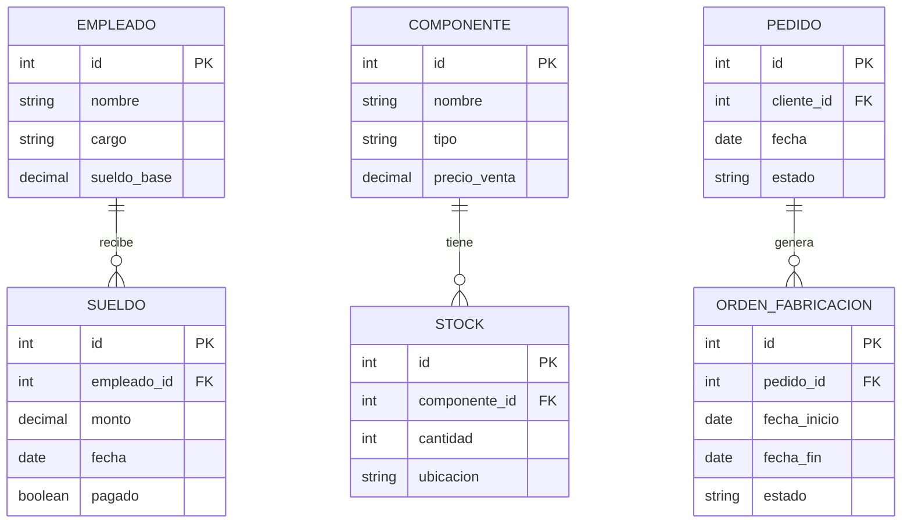

### 5.2 Modelo de Datos de Contabilidad
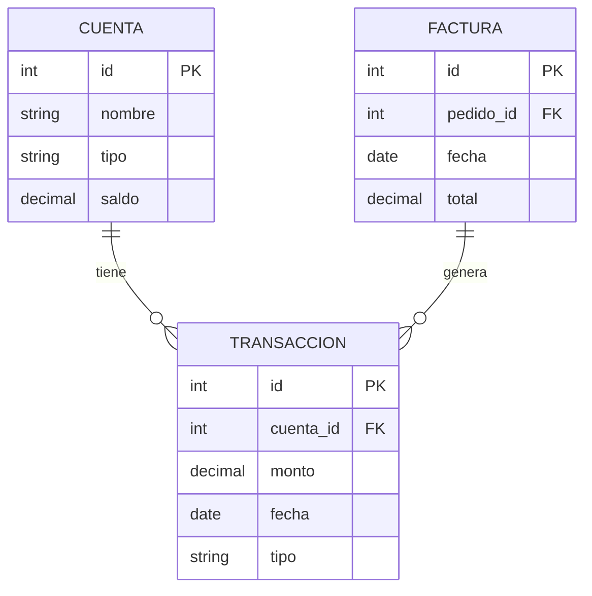